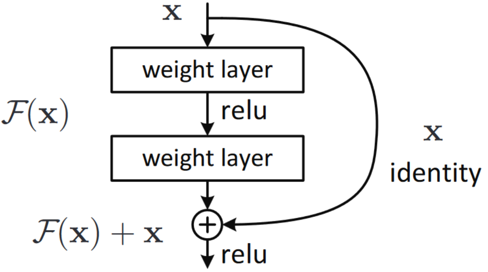
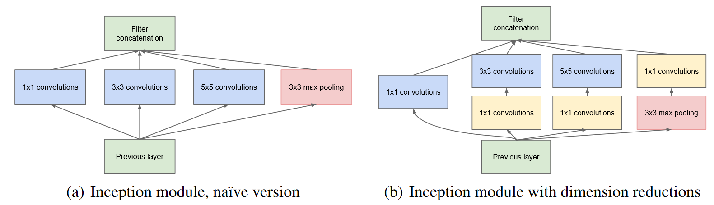
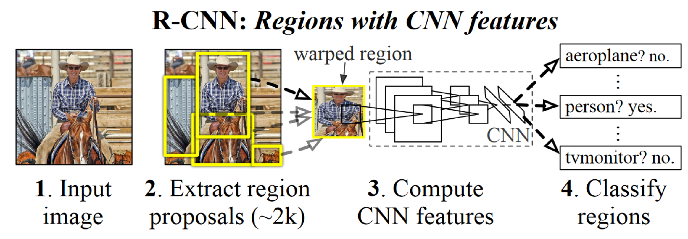
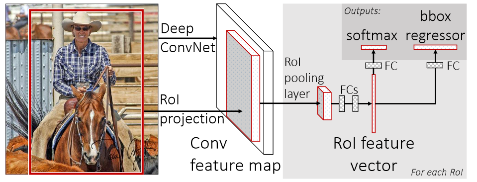
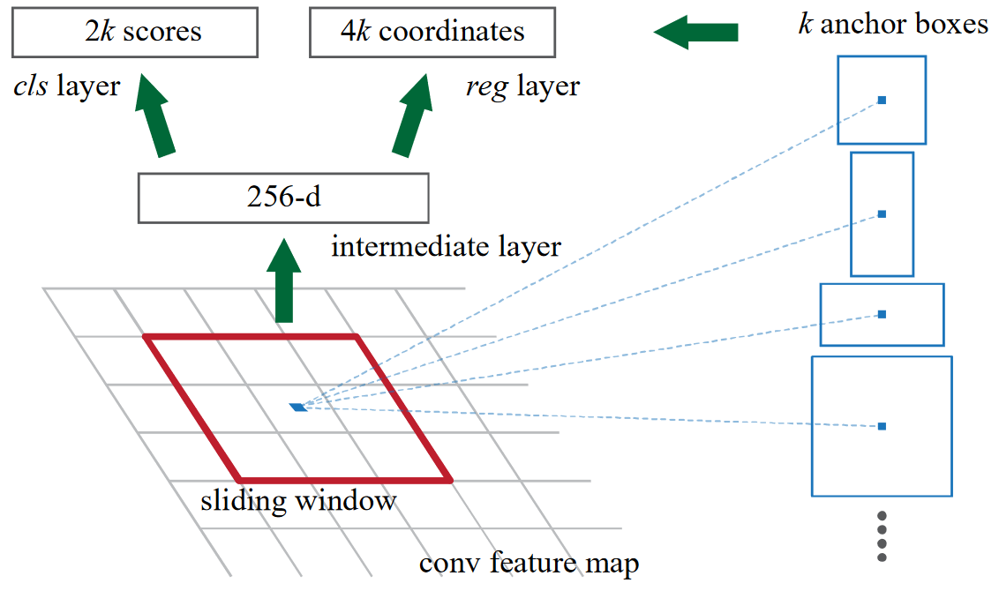
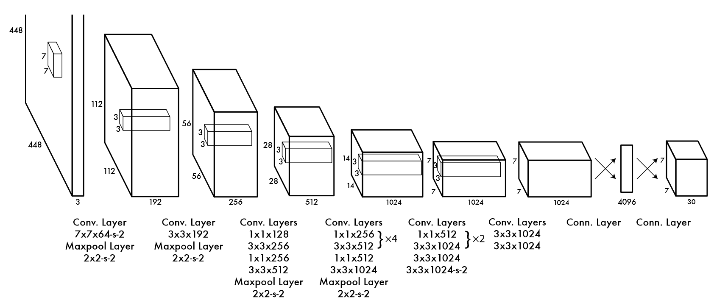
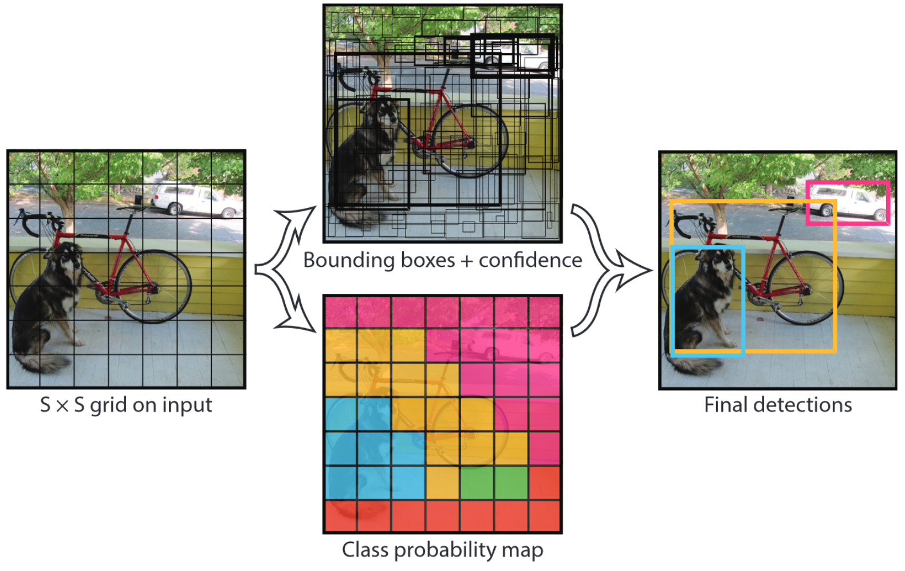

# AlexNet: ImageNet Classification with Deep Convolutional Neural Networks

# **ReLU Nonlinearity**

=max(0,x))

# **传统的饱和非线性**
 = \frac{1}{1+e^{-x}})

$$
tanh(x) = \frac{e^x+e^{-x}}{e^x+e^{-x}}
$$

优点：

- 解决梯度消失
- 加快收敛

缺点：

- 可能造成神经元死亡

# **Local Response Normalization**

$$
b_{x, y}^{i}=a_{x, y}^{i} /\left(k+\alpha \sum_{j=\max (0, i-n / 2)}^{\min (N-1, i+n / 2)}\left(a_{x, y}^{j}\right)^{2}\right)^{\beta}
$$

局部响应归一化，增大对比度，使大的相对小的更大，

lateral inhibition 横向抑制，抑制小的的影响

# **Reducing Overfitting**

由于参数过多，所以很容易对训练集过拟合

## **Data Argumentation**

人为增多数据集，下采样后256x256的图片选出224x224作为输入，因此可以图像平移与水平翻转，从而得到32x32x2=2048张图片

改变图像强度，进行主成分分析PCA，然后将主成分加倍

## **Dropout**

是神经网络中比较常用的抑制过拟合的方法。在神经网络中Dropout通过修改神经网络本身结构来实现，对于某一层的神经元，通过定义的概率将神经元置为0，这个神经元就不参与前向和后向传播，就如同在网络中被删除了一样，同时保持输入层与输出层神经元的个数不变，然后按照神经网络的学习方法进行参数更新。在下一次迭代中，又重新随机删除一些神经元（置为0），直至训练结束

# VGG：VERY DEEP CONVOLUTIONAL NETWORKS FOR LARGE-SCALE IMAGE RECOGNITION

个人感觉没什么新的，就一堆卷积操作叠加

为了减少参数量

两个 $3\times3$ 的卷积核代替一个 $5\times5$的卷积核

三个 $3\times3$ 的卷积核代替一个 $7\times7$ 的卷积核

# ResNet：Deep Residual Learning for Image Recognition

理论上越深的层，如果看作在较浅层的神经网络的扩充，那么理论上可以做到完全的复制，但实际上并不能做到

之前的神经网络如果是想训练来拟合一个函数H(X)，那么残差神经网络是想训练来拟合函数F(X)=H(X)-X，这样训练出来的神经网络可以更容易做到恒等变换。H(X)就可以通过shortcut connection来计算

# MoblieNets: Efficient Convolutional Neural Networks for Mobile Vision Applications

通过将M个 $D_k \times D_k$ 的卷积核分别作用于输入的各个通道一次，再用 1x1 的卷积核将M个通道的运算结果以一定的权重加起来

传统的神经网络回将N组M个 $D_k \times D_k$ 卷积核作用于输入的M个通道一次，然后直接将M个卷积结果加起来

Mobilenets的处理方式相当于让N组的卷积核从没啥关系变成了成比例的了，但考虑到非线性层，输出并不会线性相关

# GoogLeNet

> Q: 为什么更高层提取出的高度抽象的特征会更稀疏
> 

更高层的卷积神经网络层次结构通常会提取出更高层次和更抽象的特征，这是因为这些层次可以看做是输入数据的不同表达方式，每个层次都会增强一些特征并丢弃一些无用的信息。

此外，更高层次的特征更加稀疏是因为**输入的特征对于不同的类别有不同的重要性**。因此，对于某些类别来说，只有输入数据的少数几个特征是有意义的，所以更高层次的特征通常会更加稀疏。另外，引用中提到了在卷积神经网络中使用随机和稀疏的连接表可以打破对称性并提高学习能力，这也可以导致在特征维度上的稀疏性。

(b) 可以通过 1x1卷积控制输出的维度数从而减少 (a) 中的参数量，并引入非线性特征

网络中间的层产生的特征应该具有很强的区分性，所以有两个从中间特征连出来的**辅助分类器**。辅助分类器用于帮助提高分类准确率。在GoogleNet中，辅助分类器被插入到网络的不同层中，以生成多个类别概率分布。这些概率分布然后被用于训练网络并提高分类准确率。在评估Eval模型效果时并不起作用。

# R-CNN:Rich feature hierarchies for accurate object detection and semantic segmentation Tech report

首先利用选择性搜索算法获取初步预测的边界框。选择性搜索算法根据像素级别的特征合并各个区域，合并的规则包括颜色相似度、纹理相似度、尺寸相似度、形状相似性等。

再通过一定的变换，将初步预测的区域变成227*227像素。要么带上周围内容，要么不带周围内容，要么强行变成方的。注意要首先将初步预测的边框扩展16像素。

再使用AlexNet对每一个候选区域提取特征，得到2000*4096维的特征向量。

再用SVM分类器分类。将特征向量送入21个SVM分类器，每一个SVM分类器包含4096个参数。21个SVM分类器就相当于一个4096*21的矩阵，利用矩阵乘法计算类别。

再用非极大值抑制（NMS）方法来去除冗余候选框，对于每一个类别中IoU大于给定阈值的候选区域。

并使用一个简单的线性边界框回归来微调边界框提高定位性能。

**缺点：**提取出来的RoI会有很多区域重合，导致多次重复计算，改进方法SPPnet

**不懂：**为什么要用SVM分类器进行分类，为什么不用全连接层进行分类，虽然考虑到全连接层参数较多，但Fast R-CNN就是用全连接层进行的训练

# Fast R-CNN

同样用选择性搜索算法来提取RoI，但是参考SPPnet将计算卷积的操作合并为了一个。分类任务不采用SVM分类器，改用全连接层FC。

这篇论文主要探讨的是如何加快训练过程，并没有进行特别大的改进，当然比RCNN还是快了许多，RCNN的卷积操作包含太多的重复运算

# Faster R-CNN: Towards Real-Time Object Detection with Region Proposal Networks

Region Proposed Network将VGG16提取出的特征作为输入，输出边界框位置预测和包含物体的概率

RPN+Fast R-CNN

卷积特征图每个像素点都会作为anchor锚点，每个锚点除生成k个锚框anchor box，对每个anchor box进行二分类：是否有物体，如果有物体，则需要预测如何调整anchor box

# YOLO v1: You Only Look Once: Unified, Real-Time Object Detection

将边框作为一个回归问题，直接卷积。选择直接用卷积神经网络来输出预测边框与预测类别准确度

最终输出是一个 $7\times7\times30$的三维矩阵

将整个输入图片分为 $S\times S(S=7)$个网格grid cell，每个网格对应一个30维的向量，前10维为这个grid cell上生成的两个bounding box的五个参数，后20维是该grid cell对应20个类别的条件概率

根据输出的 $49\times2=98$个bounding box与类别概率，进行非极大值抑制 non-maximum suppression，删除冗余边界框

# YOLOv2: YOLO9000: Better, Faster, Stronger

主要改变了YOLOv1中奇怪的边界框获取方式———非极大值抑制 non-maximum suppression，改为了类似Faster RCNN中的RPN(Region Proposal Network)的**带锚点的直接调整边界框**。

还有就是训练的时候每10轮就更改一次输入图像的大小，从而强制使训练得到的网络可以接受不同大小的输入。

还有一系列改进来获取训练集的方法。

<aside>
💡 Chatgpt的回答：YOLOv2与YOLOv1的主要不同点有哪些

</aside>

> YOLOv2相对于YOLOv1有许多不同之处。首先，YOLOv2使用了更深的网络，它有19个卷积层而不是YOLOv1的9个卷积层。其次，在使用Anchor Boxes进行边界框坐标预测时，YOLOv2使用了一种更加稳定和优化的预测方法，减少了模型训练过程中的不稳定性[1]。此外，YOLOv2在预测时使用了更多的特征图，改善了目标检测的性能[1][2]。另外，YOLOv2还引入了Batch Normalization和高斯损失等技术，它们进一步帮助模型收敛和提高检测精度[1][3]。最后，YOLOv2使用了一些新的技术来加速模型训练和改善检测性能，例如使用多尺度训练和在训练时引入随机数据变换等[1][4][5]。
>

# GAN：Generative Adversarial Nets

multilayer perceptron多层感知机------前向结构的人工神经网络

判别器Discrimination和生成器Generator同时训练

# 杂

# **Neural Network**

卷积池化前后大小对比

输入大小: $W\times W$, kernel_size=F, stride=S, padding=P

输出大小 $N = \frac{W-F+2P}{S}+1$

# Dropout

一种正则化方法，用于防止深度神经网络过拟合，其主要思想是在训练过程中随机选择神经元进行忽略，从而可以减少神经元之间的依赖性，强制使网络更多地依靠其他神经元来进行预测

# Problem

为什么感觉这些著名的神经网络的设计具有一定的主观性，想设计几个卷积层就设计几个，也没有什么依据