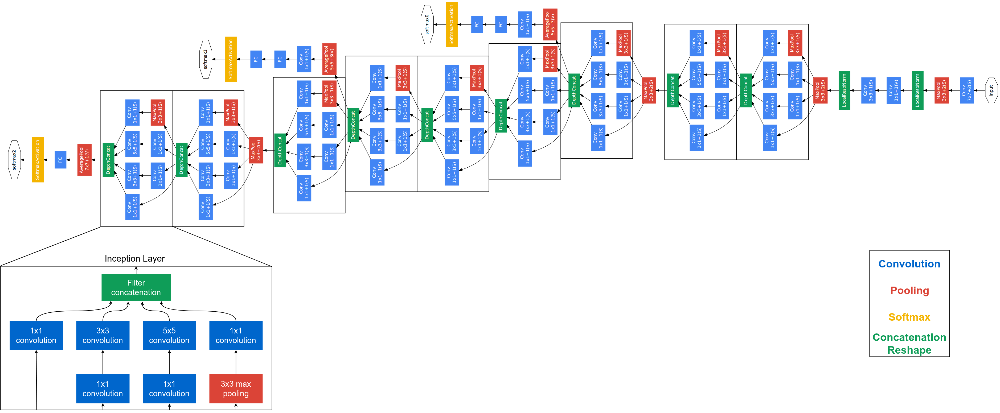

# GoogLeNet: Going deeper with convolutions

> Q: 为什么更高层提取出的高度抽象的特征会更稀疏
> 

更高层的卷积神经网络层次结构通常会提取出更高层次和更抽象的特征，这是因为这些层次可以看做是输入数据的不同表达方式，每个层次都会增强一些特征并丢弃一些无用的信息。

此外，更高层次的特征更加稀疏是因为**输入的特征对于不同的类别有不同的重要性**。因此，对于某些类别来说，只有输入数据的少数几个特征是有意义的，所以更高层次的特征通常会更加稀疏。另外，引用中提到了在卷积神经网络中使用随机和稀疏的连接表可以打破对称性并提高学习能力，这也可以导致在特征维度上的稀疏性。

(b) 可以通过 1x1卷积控制输出的维度数从而减少 (a) 中的参数量，并引入非线性特征

网络中间的层产生的特征应该具有很强的区分性，所以有两个从中间特征连出来的**辅助分类器**。辅助分类器用于帮助提高分类准确率。在GoogleNet中，辅助分类器被插入到网络的不同层中，以生成多个类别概率分布。这些概率分布然后被用于训练网络并提高分类准确率。在评估Eval模型效果时并不起作用。

