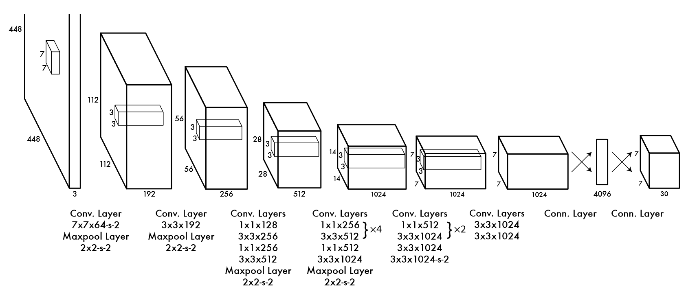

# YOLO v1: You Only Look Once: Unified, Real-Time Object Detection

将边框作为一个回归问题，直接卷积。选择直接用卷积神经网络来输出预测边框与预测类别准确度

最终输出是一个 $7\times7\times30$的三维矩阵

将整个输入图片分为 $S\times S(S=7)$个网格grid cell，每个网格对应一个30维的向量，前10维为这个grid cell上生成的两个bounding box的五个参数，后20维是该grid cell对应20个类别的条件概率

根据输出的 $49\times2=98$个bounding box与类别概率，进行非极大值抑制 non-maximum suppression，删除冗余边界框

## 分类所用技术

Single Shot Multibox Detection (SSD)：锚点，锚框