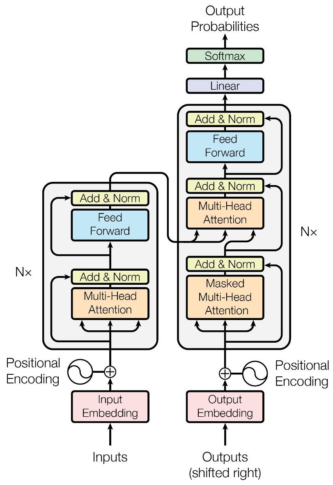
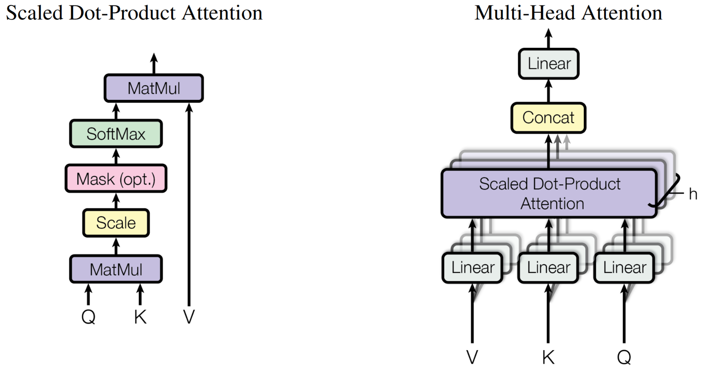

# Transformer: Attention is all you need

对标：recurrent neural networks, long short-term memory, gated recurrent neural networks

attention mechanism

encoder-decoder architectures

Multi-Head Attention

stacked self-attention and point-wise

Q: Queries, K: Key, V: Value

$$
Attention(Q,K,V)=softmax(\frac{QK^T}{\sqrt{d_k}})V
$$

# QUASTION

sequence transduction是什么

有哪些query

哪里输出的是翻译结果，输出的概率是什么