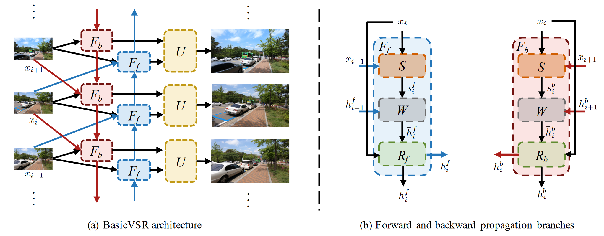
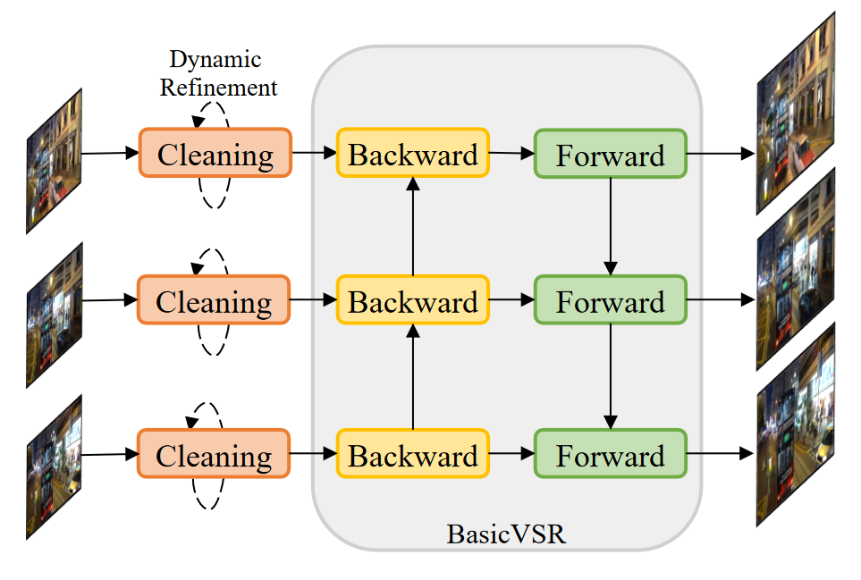

# BasicVSR: The Search for Essential Components in Video Super-Resolution and Beyond

作者提出了一个用于视频超分辨率的通用框架，称为BasicVSR。它是一种典型的双向循环网络，主要由三个模块组成：后向（B）模块、前向（F）模块和上采样（U）模块。B 模块接收下一个 B 模块、当前帧和下一帧的输出，而 F 模块接收前一个 F 模块、当前帧和前一帧的输出。然后，两个模块的输出通过U模块熔断，产生超分辨率电流帧。这些过程会迭代，直到所有帧都得到超解析。B/F 模块由通用组件组成：运动估计、空间变形和残差块。作者进一步提出了两种处理机制，即信息填充和耦合传播，它们由IconVSR算法组成。前者解决了由于未对齐导致的性能下降，后者解决了 BasicVSR 中前向处理和后向处理之间缺乏信息交互的问题。在信息填充机制中，如果当前处理的帧在选定的关键帧集中，则会进行融合;否则，对齐的结果将直接发送到残差块中，而无需融合。这种机制减轻了因错位而导致的误差累积，从而避免了性能下降。在耦合传播机制中，将后向传播的输出直接作为前向传播的输入，从而实现它们之间的信息交互。

# Investigating Tradeoffs in Real-World Video Super-Resolution

真实世界视频超分辨率 （VSR） 退化的多样性和复杂性给推理和训练带来了不小的挑战。首先，虽然长期传播在轻度退化的情况下可以提高性能，但严重的野外退化可能会通过传播被夸大，从而损害输出质量。为了在细节合成和伪影抑制之间取得平衡，他们发现图像预清洗阶段对于在传播之前减少噪点和伪影是必不可少的。作者在BasicVSR的基础上研发了 RealBasicVSR 配备了精心设计的清洁模块，在质量和效率方面都优于现有方法。其次，真实世界的 VSR 模型通常使用不同的退化进行训练以提高泛化性，需要增加批量大小以产生稳定的梯度。不可避免地，增加的计算负担会导致各种问题，包括 1） 速度性能权衡和 2） 批处理长度权衡。为了减轻第一个权衡，他们提出了一种随机退化方案，该方案可以在不牺牲性能的情况下减少多达 40\% 的训练时间。然后，他们分析了不同的训练设置，并建议在训练期间使用更长的序列而不是更大的批量，可以更有效地使用时间信息，从而在推理过程中实现更稳定的性能。

虽然[RealBasicVSR](https://github.com/ckkelvinchan/RealBasicVSR)的作者在网上开源了相关代码，但在本地复现运行相关代码也并非易事。首先需要找到或自己预训练一个性能可以达到预期的模型，用于后续超分；其次在推理视频帧的时候需要注意每次进行推理所用的帧数，以免用尽GPU的显存，用尽的结果就是会爆显存，导致先前的推理都前功尽弃。以下纪录了我在实际调试过程中所遇到的困难与相关的解决方案。

幸运的，作者在Github上也提供了预训练好的checkpoints，经过后续尝试，我发现所提供的预训练模型在真实数据集上可以达到较好的推理效果，所以我们并没有进行更多的训练，直接用作者所提供的预训练结果进行了后续的推理。当然，该程序把图像默认放大4倍，原作者并没有设计调整放大倍数这一功能，所设计的神经网络以及所预训练的模型都只能进行4倍超分，即将原图放大16倍。

解决好预训练的模型后，在实际推理的过程中，我遇到了更多的问题。众所周知，视频是由许多视频帧所构成的，为了满足人眼的观看需求，每秒最少需要24帧才能组成动态画面，这就意味着视频超分辨率所需要连续处理的图像数会是几十乃至几百帧。同时输入到推理模型中的图像至少也得是三张以上，才能体现出视频超分的时空相关性，而不是普通的图像超分。对于当前所选择的模型，一开始，我的电脑最多可以接受两张照片同时进行一起超分，三张照片都会爆显存，会输出以下错误:

> RuntimeError: CUDA out of memory. Tried to allocate 1.56 GiB (GPU 0; 6.00 GiB total capacity; 2.57 GiB already allocated; 0 bytes free; 4.07 GiB reserved in total by PyTorch) If reserved memory is >> allocated memory try setting max\_split\_size\_mb to avoid fragmentation. See documentation for Memory Management and PYTORCH\_CUDA\_ALLOC\_CONF

这段话的意思是运行时错误，CUDA内存不足。尝试分配1.56 GiB (GPU 0;6.00 GiB总容量;2.57GiB已分配;0字节空闲;4.07 GiB由PyTorch保留)。故需要想办法，把保留的内存释放出来，提高碎片内存的利用率。当max\_split\_size\_mb参数值小于显存请求的大小时就可以正常运行。通过读懂 PyTorch 显存管理机制文章，由于默认策略是所有大小的空闲块都可以被分割，所以导致OOM的显存请求发生时，所有大于该请求的空闲块有可能都已经被分割掉了。而将max\_split\_size\_mb设置为小于该显存请求的值，会阻止大于该请求的空闲块被分割。如果显存总量确实充足，即可保证大于该请求的空闲块总是存在，从而避免了分配失败的发生。我的情况，显存总量是6G，那么最理想的条件下，大于1.56G的空闲块最多也只能有4个，这就解释了为什么OOM是高概率随机出现。所以需要通过调小max\_split\_size\_mb的值从而来提高内存的利用率，但同时要意识到这个值越小会将内存块分为更小的块，意味着系统需要不断寻找内存块，导致系统性能的下降。所以需要将max\_split\_size\_mb设置为小于OOM发生时的显存请求大小最小值的最大整数值，就可以在保证跑大图的可行性的同时最大限度照顾性能。在实际运行中，我添加了以下代码，来设置该参数为256MB。

    os.environ["PYTORCH_CUDA_ALLOC_CONF"]="max_split_size_mb:256"

当"max\_split\_size\_mb:256"时，可以10张图片一起超分，但对于15张图片同时作为输入进行超分仍然会爆显存，但同时输入10张进行推理参考前后信息也是可以接受的照片数量。当然，可以选择继续减小max\_split\_size\_mb，在减小效率的同时，增加系统的稳定性，或者每次提取出10张图片进行超分，在此我选择后者，每次提取出10张图片作为输入。

我一开始的想法是，每次通过opencv从视频中抽取10帧作为输入放入一个文件夹中，再调用推理函数去对该文件夹进行推理。但实际运行发现这样效率太低，每次调用推理函数，都意味着需要重新将模型加载到GPU的内存中，这就需要耗费大量的时间。我通过阅读源代码发现原作者有提供max\_seq\_len最大推理参数这个变量可以进行编辑，将会自动控制同时进行推理的帧数。这就意味着，我可以利用ffmpeg将所有帧都抽取出来存入一个文件夹中，推理函数会自动去控制同时进行推理的帧数，这样就不需要每次运行都重新加载模型到GPU的内存中，节约了大量时间。

但通过设置同时处理的帧数，在对一百多帧每次推理十帧的运行快结束进行保存的环节，也会很容易爆显存，出现上述类似的报错。这问题就不出现在推理上，而出现在最终将推理结果进行保存的环节中。通过实验，我发现源代码处理100帧的推理用时486.89 秒，且最后电脑会整个卡住，这就意味着整个CPU都被占满了。通过阅读源代码，我发现代码原本的设计是当所有图片都处理完后再进行保存，这就导致在保存时很容易会导致内存爆炸，所以需要经过修改我改为了每处理一批的视频帧就进行保存。同时，为了方便起见，我决定设计为在网页中选择mp4作为输入，并通过ffmpeg就将视频变为视频帧，将视频帧作为输入，去进行超分，这样就可以删掉inference\_realbasicvsr.py中对于输入类型的判断。经过上述修改，超分系统的稳健性大幅上升，只要通过控制max\_seq\_len来控制每次输入超分模型的图片数，就可以保证系统运行的稳定性。