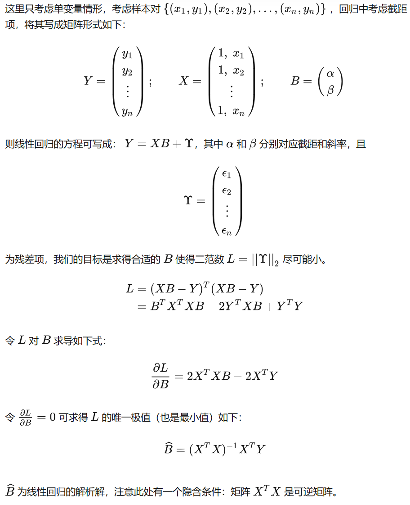

# Dive into deep learning

# 线性回归解析解

**矩阵求导**

$$
\frac{\partial (\bold x^T\bold a)}{\partial\bold x}=\frac{\partial(\bold a^T\bold x)}{\partial\bold x}=\bold a\\ \frac{\partial(\bold x^T\bold x)}{\partial\bold x}=2\bold x
$$

SGD: Stochastic Gradient Desent