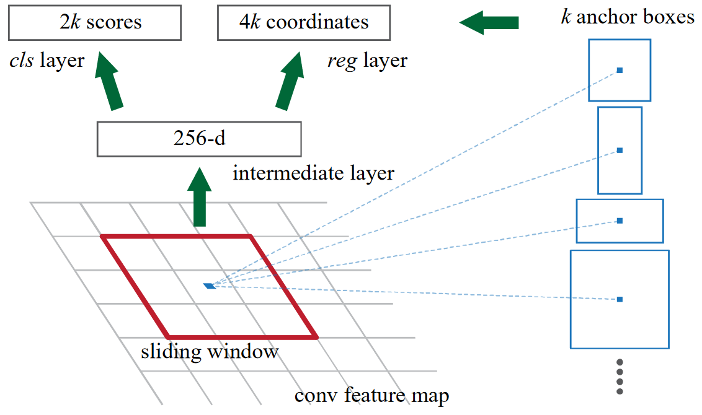

# Faster R-CNN: Towards Real-Time Object Detection with Region Proposal Networks

Region Proposed Network将VGG16提取出的特征作为输入，输出边界框位置预测和包含物体的概率

与Fast R-CNN比就是将选择性搜索替换为了区域提议网络

RPN+Fast R-CNN

卷积特征图每个像素点都会作为anchor锚点，每个锚点除生成k个锚框anchor box，对每个anchor box进行二分类：是否有物体，如果有物体，则需要预测如何调整anchor box