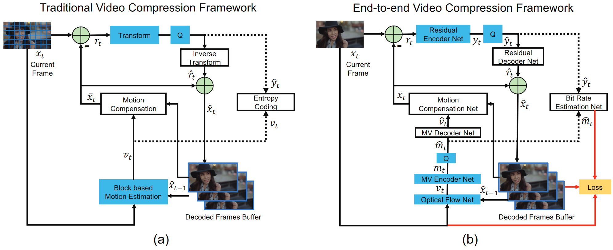
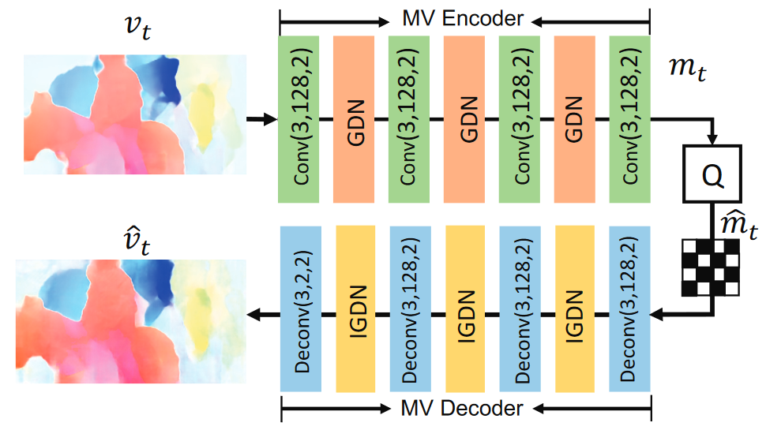
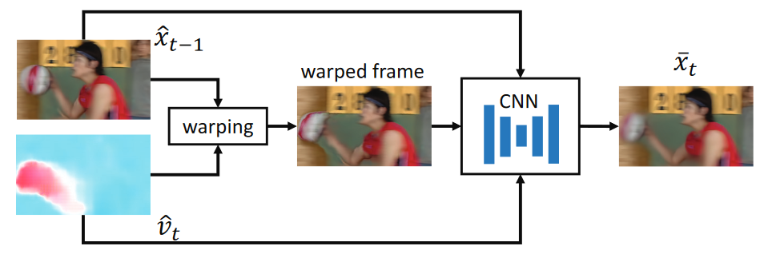

# DVC: An End-to-end Deep Video Compression Framework

## Key Points

end-to-end video compression deep model

learning based optical flow estimation

auto-encoder style neural networks

Rate-distoration optimization(RDO)

context models to learn the adaptive / non-adaptive arithmetic coding method

generalized divisive normalization (GDN): 一种更适合图像重建的归一化层

## Proposed Method

### Step 1. Motion estimation and compression

CNN model to estimate the optical flow

<aside>
💡 A. Ranjan, Optical flow estimation using a spatial pyramid network, CVPR 2017

</aside>

MV encoder-decoder network: an auto-encoder style network to compress the optical flow

### Step 2. Motion compensation

### Step 3-4. Transform, quantization and inverse transform

Transform and inverse:  highly non-linear residual encoder-decoder network

<aside>
💡 J. Balle, Variational image compression with a scale hyperprior, arXiv 2018

</aside>

Quantization: in order to build ab end-to-end training scheme 量化操作不可差分

replace the quantization operation by adding uniform noise in the traning stage

<aside>
💡 J. Balle, End-to-end optimized image compression, arXiv 2018

</aside>

### Step 5. Entropy coding

CNNs Bit rate estimation net to obtain the probability distribution of each symbol

通过CNN估计高斯分布的参数

> The correct measure for bitrate is the entropy of the corresponding latent representation symbols.
> 

<aside>
💡 J. Balle, Variational image compression with a scale hyperprior, arXiv 2018

</aside>

### Step 6. Frame reconstruction