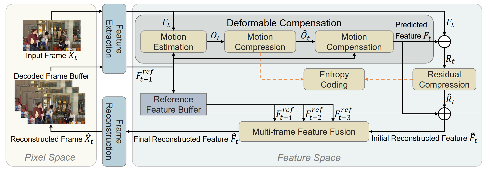
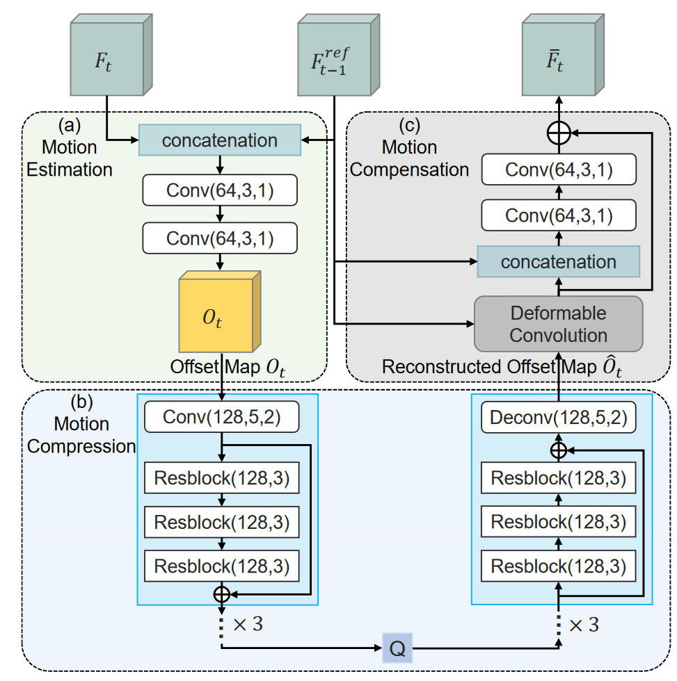
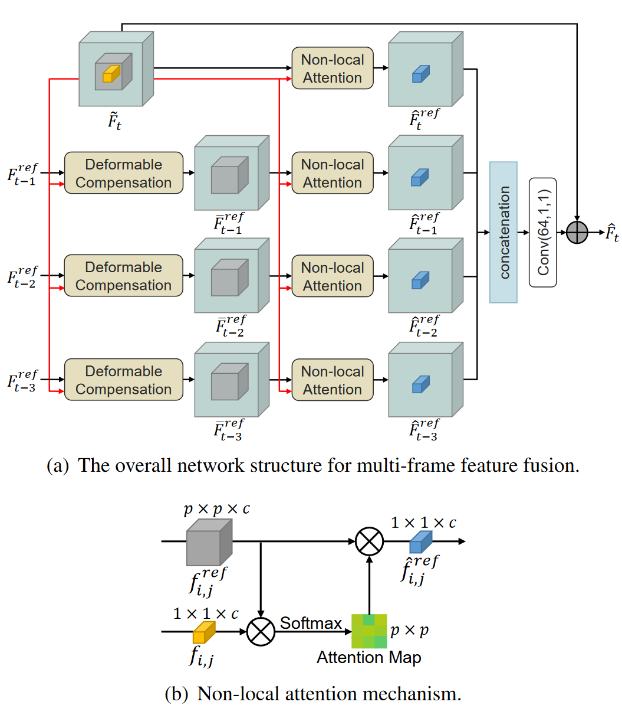

# FVC: A New Framework towards Deep Video Compression in Feature Space

## Key Points

motion estimation, motion compression, motion compensation

deformable compensation module

nonlocal attention mechanism

hand-designed module: block-based motion estimation, Discrete Cosine Transform(DCT)

optical flow estimation

complex non-rigid motion pattern

motion information: offset maps for convolution kernels in deformable convolution

auto-encoder style network

end-to-end optimized video compression framework

### Proposed Method

Hyperprior entropy model: accurate bitrate estimation

通过CNN估计高斯分布的参数

<aside>
💡 David Minnen, Johannes Balle, Joint autoregressive and hierarchical priors for learned image compression, In Advances in Neural Information Processing Systems,2018(这个作者也是Johannes Balle)

</aside>

Quantization:

量化操作不可微

<aside>
💡 Johannes Balle, David Minnen, Variational image compression with a scale hyperprior. International Conference on Learning Representations (ICLR), 2018

</aside>

这两个操作和DVC中的操作是一致的

# 相关论文

Deformable convolutional networks

DVC: An end-to-end deep video compression framework

attention mechanism