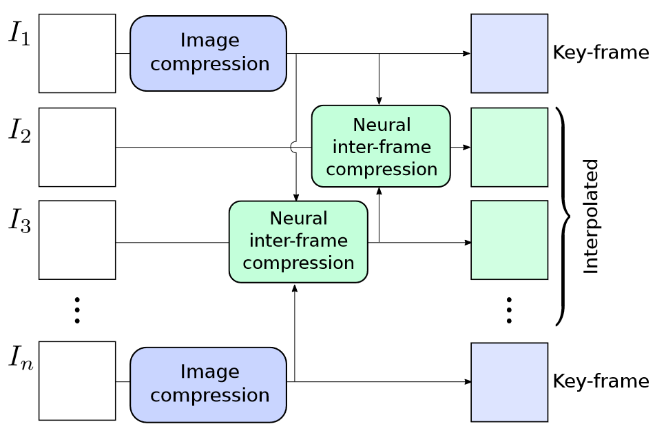
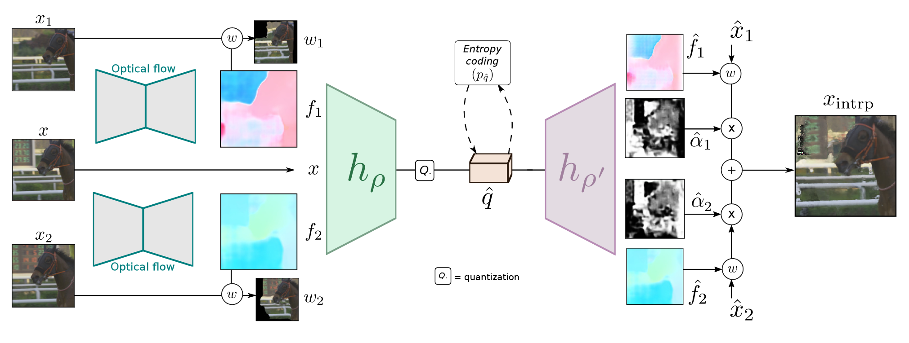
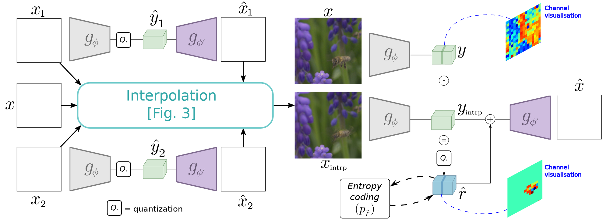

# Neural Inter-Frame Compression for Video Coding

B帧前后参考。整体流程如下，好像参考帧位置是随机进行选择的，说实话感觉整个流程很难流畅的运行起来，对于单帧的压缩逻辑是通的，但整个视频的压缩逻辑没太看懂

运动补偿和运动估计：参考帧$x_1,x_2$,待压缩帧$x$,光流信息$f_1,f_2$全部输入一个encoder-decoder框架进行编码，最终解码得到一个插入帧，encoder的结果进行量化后进行熵编码

残差：参考帧和插值帧都输入另一个encoder-decoder框架进行压缩，将latent presentation做残差，然后量化后进行熵编码

也依靠Johannes Balle和David Minnen的经典论文，这篇文章甚至连encoder-decoder也完全不改

optical flow estimation: PWC-Net 预训练好的结果，不进行更改

encoder-decoder pair和量化：

为了近似在瓶颈中执行的量化运算，我们在训练期间为潜在空间值添加了一个独立的均匀噪声。这在下文中被证明是舍入操作的连续可微松弛。

<aside>
💡 Johannes Balle. End-to-end optimized image compression, ICLR, 2017
</aside>

预测熵编码后的码率：通过CNN估计高斯分布的参数

<aside>
💡 David Minnen, Johannes Balle, Joint autoregressive and hierarchical priors for learned image compression, NeurIPS. 2018
</aside>