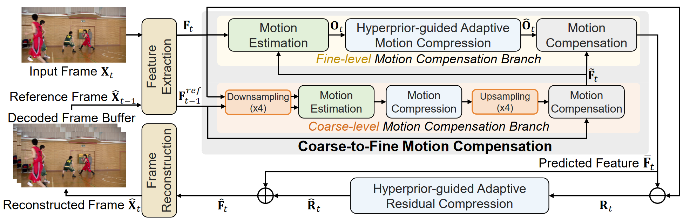
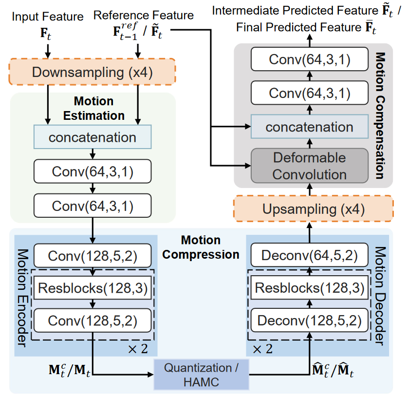
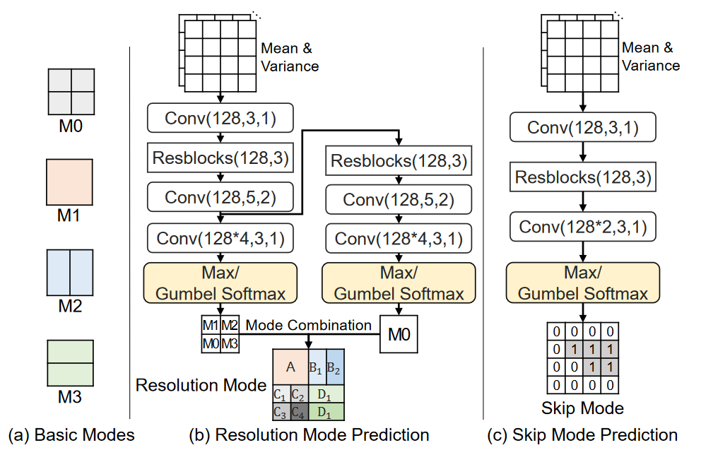
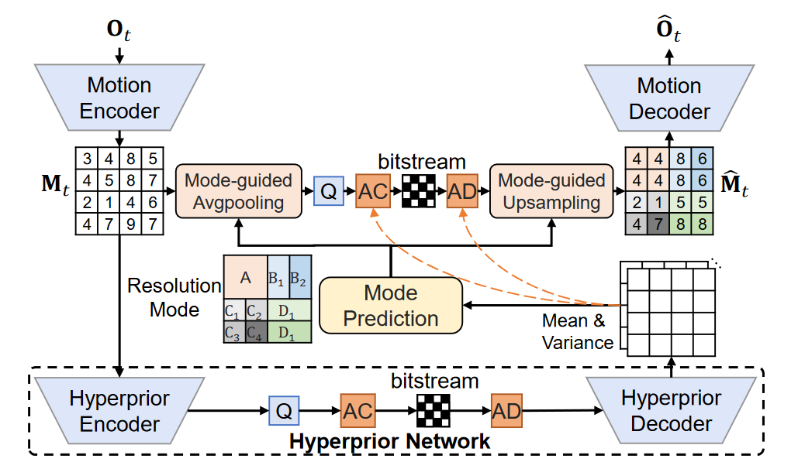

# Coarse-to-fine Deep Video Coding with Hyperprior-guided Mode Prediction

## Key Points

mode prediction technique

mode prodiction networks by  using hyperprior information (i.e., the mean and variance values) from the hyperprior networks contains **discriminant statistical information** of different patches

skip residual information from each block

coase-to-fine strategy: 

optical flow estimation: pyramid structure

video super-resolution: coarse-to-fine alignment strategy

gumbel softmax layer: 离散概率分布

## Framework

$F_{t-1}^{ref}$和$F_t$下采样后进行粗粒度的Motion Estimation, Motion Compression再上采样得到粗粒度的offset map后，对$F_{t-1}^{ref}$进行Motion Compensation，得到Coarse-level Motion Compensation Branch结果$\tilde F_t$。将$F_t$和$\tilde F_t$进行细粒度的Motion Estimation, Motion Compression,Motion Compensation，得到最终的$\bar F_t$。以上的网络结果基本参考FVC的设计。

通过Mode Prediction获得Latent Presentation的区域池化合并方案，和残差块忽略方案，进一步节约带宽

The **max operation is undifferentiable**, so the whole network cannot be end-to-end optimized through back-propagation. To address this issue, during the training process, we adopt the **Gumbel softmax strategy** to decide the optimal mode as this Gumbel softmax module is differentiable, which thus enables end-to-end optimization for the whole network.

Our proposed HAMC method can automatically **select large block sizes in smooth areas with less significant motion patterns** for bit-rate saving and use small block sizes for areas around moving object boundaries for achieving more accurate motion compensation results.

### Bit estimation network

<aside>
💡 David Minnen, Johannes Balle, and George D Toderic, Joint autoregressive and hierarchical priors for learned image compression, In Advances in Neural Information Processing Systems, pages 10771–10780, 2018.

</aside>

Without using the time-consuming auto-regressive model to estimate the bits for compressing

### Simple bit-estimation network

<aside>
💡 Johannes Balle, Valero Laparra, and Eero P Simoncelli, Endto-end optimized image compression, International Conference on Learning Representations (ICLR), 2017

</aside>

## Related work 前置工作

FVC: A new framework towards deep video compression in feature space

Improving deep video compression by resolution-adaptive flow coding